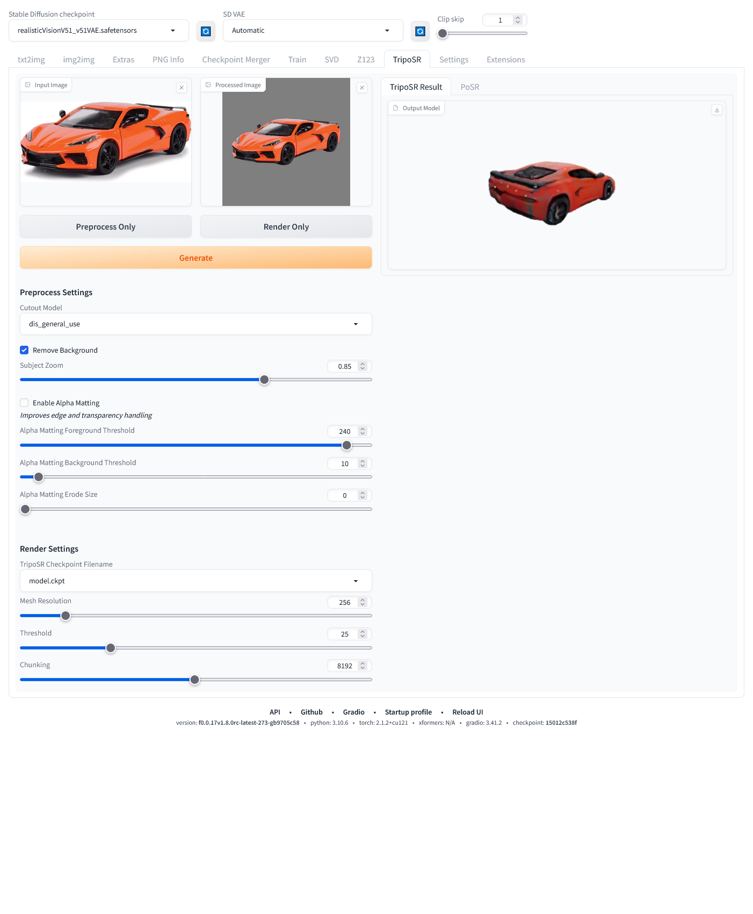
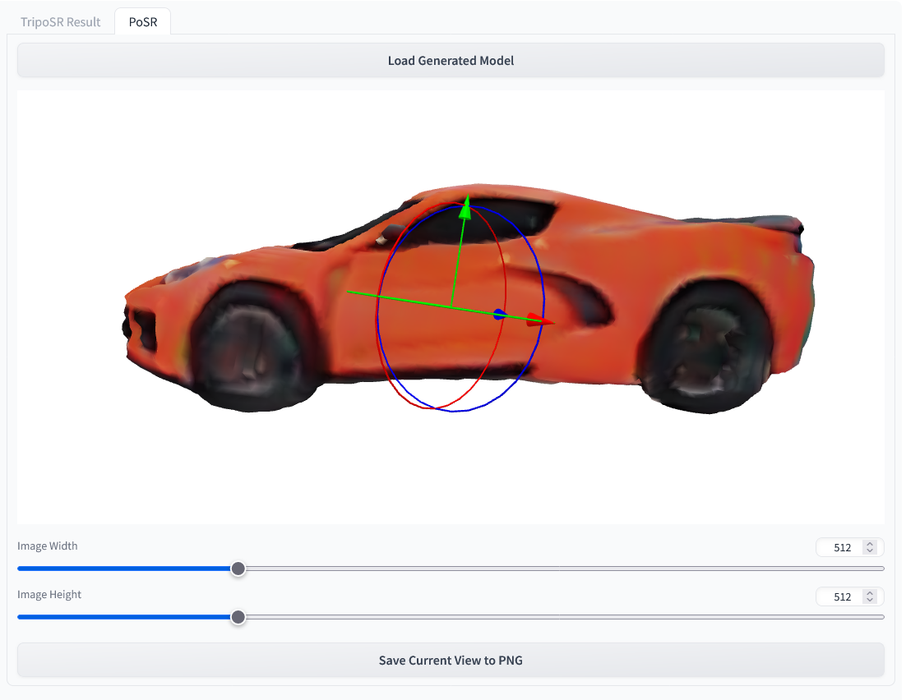

# TripoSR-webui
A TripoSR implementation for WebUI


From the Official [Github Page](https://github.com/VAST-AI-Research/TripoSR):
>Leveraging the principles of the [Large Reconstruction Model (LRM)](https://yiconghong.me/LRM/), TripoSR brings to the table key advancements that significantly boost both the speed and quality of 3D reconstruction. Our model is distinguished by its ability to rapidly process inputs, generating high-quality 3D models in less than 0.5 seconds on an NVIDIA A100 GPU. TripoSR has exhibited superior performance in both qualitative and quantitative evaluations, outperforming other open-source alternatives across multiple public datasets. The figures below illustrate visual comparisons and metrics showcasing TripoSR's performance relative to other leading models. Details about the model architecture, training process, and comparisons can be found in this [technical report](https://arxiv.org/abs/2403.02151).

This implmentation of the TripoSR model is an extension for [Stable Diffusion web UI](https://github.com/AUTOMATIC1111/stable-diffusion-webui). Currently, it has only been tested on the release version of [Stable Diffusion WebUI Forge](https://github.com/lllyasviel/stable-diffusion-webui-forge) but it is likely to work correctly on the original variant as well. If you do not already have either of these applications, please follow the instructions for the variant you select prior to installing this extension.

## Installation
Clone this repository into your /extensions folder for web UI. 
```git clone https://github.com/Z-L-D/TripoSR-webui```



## Usage
There are multiple models used in this extension. The TripoSR model downloads automatically at installation and will likely be placed into the /models/diffusers/models--stabilityai--TripoSR folder but there will also be a reference file in /models/TripoSR. There will are also a number of background removal models that will download to /models/U2NET whenever they are used for the first time.

TripoSR-webui has multiple modes of operation.

### Fully automatic - leave all settings as they are:
1. Select an input image you would like to convert
2. Press the generate button
This will proceed to use all default options, which will often work well enough, and ultimately end up with a rendered model on the right side of the screen. The rendered OBJ is vertex colored and will automatically be saved into the /outputs/TripoSR folder.

### Fine grain control:
1. Select an input image
2. Press the 'Process Only' button
3. Fine tune the prepocess settings and repeat step 2 until you have reached a satisfying processed image cutout
4. Fine tune the render settings
5. Press the 'Render Only' button
This provides a more fine grained iterative approach to generating the rendering. It is imperative that the image cutout is as clean cut around your intended object as possible. For example, if you are attempting to capture a toy train and the image cutout has left stray remnants of other objects in the image, it is far less likely to produce a satisfying coherent model than it otherwise would if the cutout was further cleaned. As such, its also important to note that the cutout models are not perfect and can often leave annoying unwanted stray remnants of other objects in the image cutout. If this is happening, you can save the current processed image cutout and further modify it to your liking in an image editor and upload it once again by dropping it into the 'Processed Image' box, replacing the original cutout image.



### PoSR
In addition to the TripoSR rendering pipeline, there is also a provided feature that allows you to further manipulate your rendered object into a prefered orientation and then save it to a PNG that can be fed back into img2img.

1. After rendering a new object, select the PoSR tab on the upper right column.
2. Press the 'Load Generated Model' button
3. Manipulate the object with the positioning gizmo and use the mouse to manipulate the camera
    * left mouse button: orbit control
    * mouse wheel: zoom control
    * right mouse button: pan control
4. Select your output image size. This image will be height bound to the visible canvas on your screen. This means if it currently wider than it is tall, selecting a portrait resolution of 768x1024, will maintain the current appearance of the object between the upper and lower portions of the canvas, cropping the left and right portions of the present view. Selecting 2048x1024, will continue to maintain the current appearance of the object between the upper and lower portions of the canvas and will instead have very wide margins on either side of the object.
5. Press the 'Save Current View to PNG' button. This will trigger an automatic download, either prompting you to select a location to save the file or more likely automatically downloading it to your selected downloads folder. You will need to navigate to this location to feed it into img2img.

